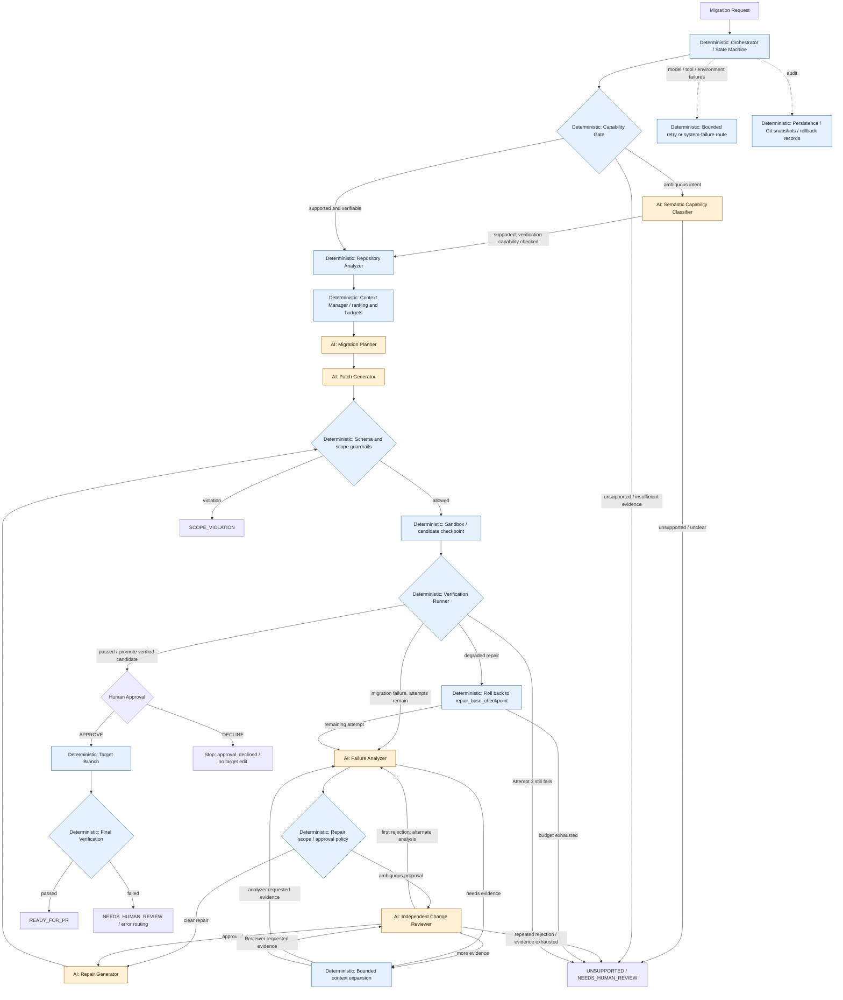

# Architecture

The deterministic Orchestrator owns every transition in the workflow below.
Orange **AI** nodes propose or assess changes; blue **deterministic** nodes constrain
execution. Human approval is a separate gate. The displayed arrows are the main
execution paths, not a replacement for the [full state machine](../src/patchpilot/workflow/state.py).

Context expansion resumes the requesting analysis or review under Orchestrator
control; it does not authorize a patch. The classifier does not override deterministic capability checks.
Guardrails also cover the plan and repair proposal, not just initial patch application.

## Why these boundaries exist

| Boundary | Responsibility |
| --- | --- |
| Orchestrator and state machine | Decide legal next actions, retries, termination, and escalation; models cannot set state. |
| Capability Gate and guardrails | Reject unsupported intent deterministically where possible; enforce permitted paths and migration scope. |
| Repository Analyzer and Context Manager | Combine repository evidence, rank focused snippets, and enforce file/snippet/token-estimate budgets. |
| AI components | Return typed plans, patches, diagnoses, or review decisions; none gets direct write authority. |
| Sandbox and verifier | Apply proposals in an isolated Git copy and run migration checks, pytest, mypy, Ruff, and import/runtime checks. |
| Approval and target verification | Require approval before target-branch modification, then verify the transferred patch again. |

The local sandbox is not a security sandbox. Git snapshots make changes recoverable;
they do not contain malicious test code or restrict its operating-system privileges.

## Repair checkpoints and failure routing

Attempt 1 generates the migration. Attempts 2 and 3 repair it; there is no Attempt 4.
The analyzer sees the current diff, failed verification, plan, prior attempts, and
selected context. Deterministic policy can approve an unambiguous, in-scope repair;
otherwise the independent Reviewer can approve, reject, or request focused evidence.

`repair_base_checkpoint` is the exact pre-repair candidate, which may still fail
migration tests. A degraded repair restores that candidate instead of unnecessarily
throwing away all migration progress. `last_verified_stable` is the conceptual
verified baseline, represented by the sandbox stable ref and
`last_verified_stable_snapshot_id` in repair records. Only a candidate that passes
verification is promoted to stable. Budget exhaustion escalates to human review.

An executed check exposing broken migrated code can enter repair. A malformed model
response, failed tool, unavailable interpreter/dependency, or SQLite error follows
the separate bounded recovery/system-failure paths; none is evidence that application
code needs changing. Exact terminal routing is visible in the state history.

## Auditability

**SQLite:** run state, transition history, serialized attempt records, context,
plans/proposals, Reviewer decisions, verification results, and model telemetry.

**Git / filesystem:** initial and candidate snapshots, stable references, rollback
targets, verified diffs, target branches, snapshot bundles, and exported JSON/SQLite.
The [artifact guide](../artifacts/README.md) links representative evidence.

A run's recorded context and structured outputs explain what evidence was selected,
what was proposed and changed, what failed, what was reviewed or rolled back, and
its final state. The model-call record contains input metadata rather than a full
outbound request transcript, so exact provider-request replay is not guaranteed.

## Contract compatibility

Workflow contracts intentionally use `pydantic.v1` under supported Pydantic 1 or 2
installations. This removes v2 deprecation warnings without changing field semantics,
serialized run records, or model schemas. The old-API benchmark fixtures remain
untouched: their deprecated APIs are the migration input, not cleanup candidates.
The evaluation freeze manifest is refreshed only for these compatibility imports;
control flow and fixture hashes are preserved. Historical evidence retains the
prompt versions that produced it.
